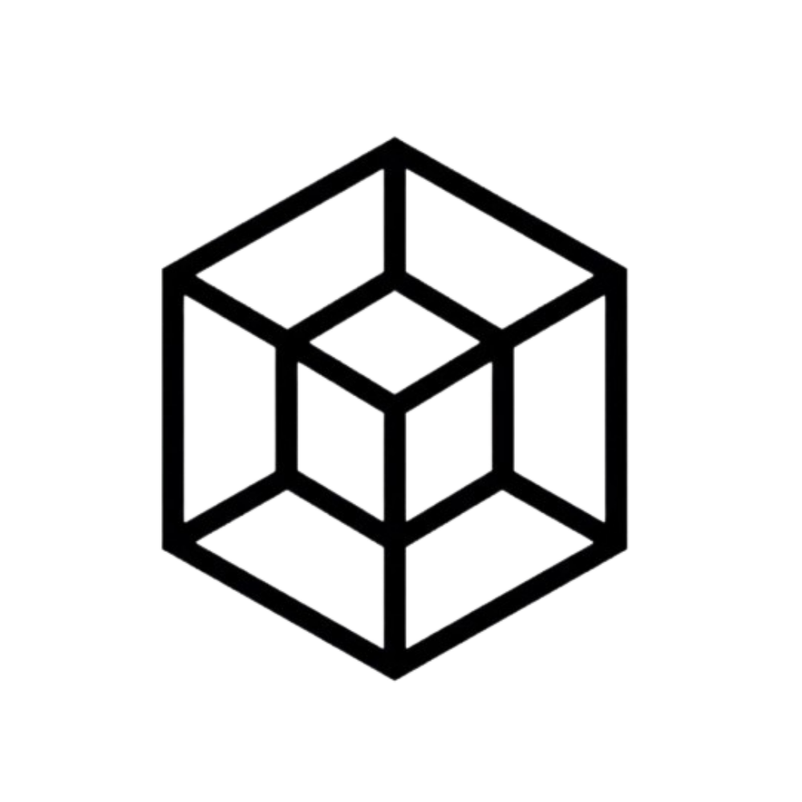

<div align="center">
  <h1>Tesseract</h1>
  <p>Plataforma SaaS para construir y desplegar agentes de inteligencia artificial conversacionales.</p>

  

  <br />
  <br />


</div>

---

## Que es Tesseract?

Tesseract es el codigo base interno de **Fractal**. Permite a las organizaciones crear **Workflows** de IA (agentes conversacionales) y ofrecerselos a sus usuarios finales a través de un widget de chat o API, con gestión integrada de:

- Autenticacion (email/contraseña + Google OAuth)
- Multi-tenancy con control de acceso por roles (RBAC)
- Motor de IA (OpenAI, Anthropic y más, con streaming)
- Facturacion y suscripciones (Stripe, con sistema de creditos y overage)

---

## Arquitectura General

```
+-----------------------------------------------------------+
|                       USUARIO FINAL                       |
+------------------------+----------------------------------+
                         | HTTP / Browser
+------------------------v----------------------------------+
|          Frontend - Web-Client (Next.js)                  |
|         Dashboard, Chat Widget, Billing UI                |
|                    [ Vercel ]                             |
+------------------------+----------------------------------+
                         | REST API (JSON + JWT)
+------------------------v----------------------------------+
|           Backend - Gateway (NestJS)                      |
|   Auth, RBAC, Billing, Workflows, Executions              |
|               [ Google Cloud Run ]                        |
+---------------+---------------------------+---------------+
                | HTTP Interno              | Prisma ORM
+---------------v-----------+  +-----------v---------------+
|  Agents - Python          |  |  PostgreSQL (Cloud SQL)   |
|  (FastAPI + LangChain)    |  |  Datos relacionales       |
|  [ Google Cloud Run ]     |  +---------------------------+
+---------------------------+
```

---

## Estructura del Repositorio

```
Tesseract/
├── apps/
│   ├── gateway/        -> Backend principal (NestJS/TypeScript)
│   ├── web-client/     -> Frontend (Next.js/React)
│   └── agents/         -> Microservicio de IA (Python/FastAPI)
├── packages/
│   ├── @tesseract/database  -> Schema de Prisma y migraciones
│   └── @tesseract/types     -> DTOs e interfaces TypeScript compartidas
├── docs/               -> Documentacion completa (Mintlify)
├── docker-compose.yml  -> PostgreSQL local para desarrollo
└── package.json        -> Orquestador del monorepo (pnpm workspaces)
```

---

## Inicio Rapido

**Eres nuevo en el equipo? Sigue esta guia en orden:**

### Prerrequisitos

| Herramienta     | Version            | Requerido para        |
| --------------- | ------------------ | --------------------- |
| Node.js         | v22 LTS            | Todo                  |
| pnpm            | v11+               | Todo                  |
| Docker          | Cualquier reciente | Base de datos local   |
| Python + Poetry | 3.11+              | Solo modulo `agents`  |
| Stripe CLI      | Ultima             | Solo pruebas de pagos |

### Instalacion

```bash
# 1. Clona el repositorio
git clone https://github.com/FractalIndustries/Tesseract.git
cd Tesseract

# 2. Instala todas las dependencias del monorepo
pnpm install

# 3. Configura tus variables de entorno
cp .env.example .env
# Edita el .env con tus valores (ver guia completa abajo)

# 4. Levanta todos los servicios de desarrollo
make dev   # Postgres + Gateway (:3000) + Web (:3001) + Agents (:8000)
```

Para una guia detallada de variables de entorno y configuraciones opcionales, visita **[docs/setup/local-env.md](docs/setup/local-env.md)**.

---

## Documentacion

Toda la documentacion tecnica vive en `/docs` y esta publicada con Mintlify:

| Seccion              | Documento                                                  |
| -------------------- | ---------------------------------------------------------- |
| Arquitectura general | [system-design.md](docs/architecture/system-design.md)     |
| Monorepo y comandos  | [monorepo.md](docs/architecture/monorepo.md)               |
| Backend (NestJS)     | [backend-design.md](docs/architecture/backend-design.md)   |
| Frontend (Next.js)   | [frontend-design.md](docs/architecture/frontend-design.md) |
| Agentes (Python)     | [agents-design.md](docs/architecture/agents-design.md)     |
| Base de datos        | [database-schema.md](docs/architecture/database-schema.md) |
| Facturacion (Stripe) | [billing.md](docs/manuals/billing.md)                      |
| Roles y permisos     | [rbac.md](docs/manuals/rbac.md)                            |
| Motor de ejecucion   | [executions-engine.md](docs/manuals/executions-engine.md)  |
| Workflows            | [workflows.md](docs/manuals/workflows.md)                  |
| Despliegue (GCP)     | [deployment.md](docs/setup/deployment.md)                  |
| Stripe local         | [stripe-local.md](docs/setup/stripe-local.md)              |

---

## Contribuir

Si eres parte del equipo y vas a hacer cambios al codigo, lee primero la guia de contribucion:

**[docs/contributing.md](docs/contributing.md)**

---

## Soporte

Contacto interno: **support@fractal.com**
