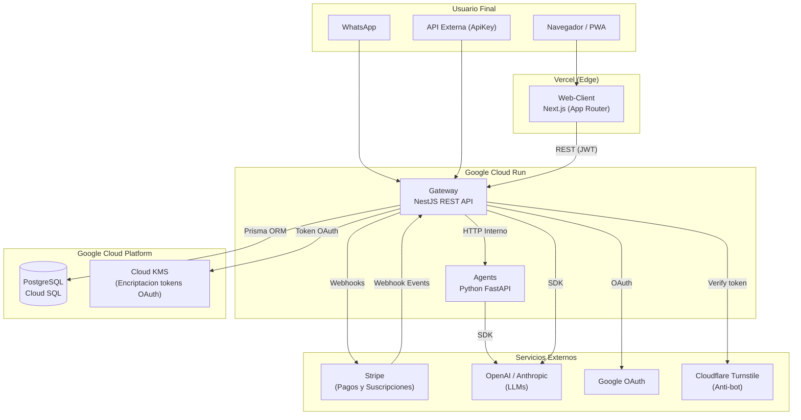
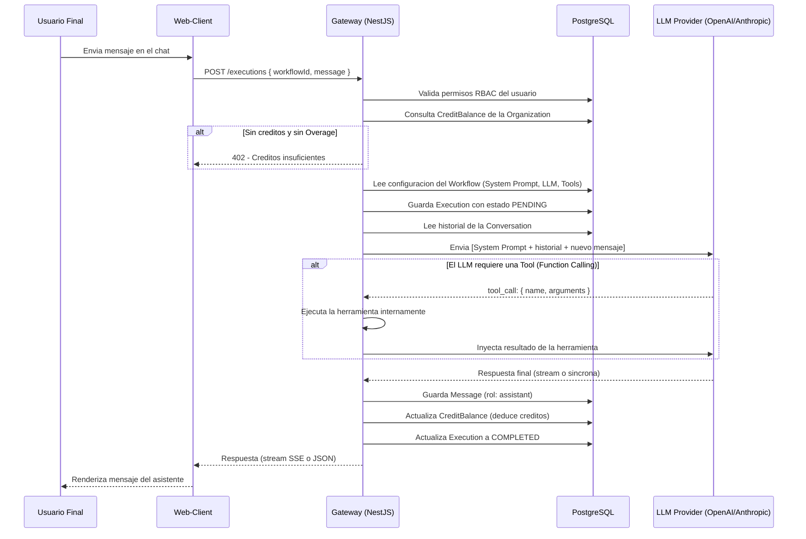

## 1. Componentes y Flujo de Datos

Este diagrama muestra los componentes principales del sistema y como se comunican entre si.



---

## 2. Ciclo de Vida de una Ejecucion (Flujo de IA)

Secuencia detallada de lo que ocurre desde que el usuario manda un mensaje hasta que recibe la respuesta.



---

## 3. Diagrama Entidad-Relacion (Base de Datos)

Las entidades principales del sistema y sus relaciones.

```mermaid
erDiagram
    Organization {
        uuid id PK
        string name
        string slug UK
        enum plan
        boolean allowOverages
        string stripeCustomerId UK
    }

    User {
        uuid id PK
        string email UK
        string name
        string role
        uuid organizationId FK
    }

    EndUser {
        uuid id PK
        string phoneNumber
        string email
        string externalId
        uuid organizationId FK
    }

    Subscription {
        uuid id PK
        uuid organizationId FK UK
        enum plan
        enum status
        datetime currentPeriodEnd
        string stripeSubscriptionId UK
        enum pendingPlanChange
    }

    CreditBalance {
        uuid id PK
        uuid organizationId FK UK
        float balance
        float currentMonthSpent
        float lifetimeEarned
        float lifetimeSpent
    }

    CreditTransaction {
        uuid id PK
        uuid organizationId FK
        enum type
        float amount
        float balanceBefore
        float balanceAfter
        uuid executionId FK UK
        uuid invoiceId FK
    }

    Invoice {
        uuid id PK
        uuid organizationId FK
        string invoiceNumber UK
        enum type
        enum status
        float total
        string stripeInvoiceId UK
    }

    Workflow {
        uuid id PK
        uuid organizationId FK
        string name
        enum category
        string systemPrompt
    }

    Conversation {
        uuid id PK
        uuid organizationId FK
        uuid workflowId FK
        uuid userId FK
        uuid endUserId FK
        string channel
        string status
    }

    Message {
        uuid id PK
        uuid conversationId FK
        string role
        string content
        string model
        int tokens
        float cost
    }

    Execution {
        uuid id PK
        uuid organizationId FK
        uuid conversationId FK
        string status
    }

    ApiKey {
        uuid id PK
        uuid organizationId FK
        uuid workflowId FK
        string keyHash UK
    }

    ToolCatalog {
        uuid id PK
        string toolName UK
        string displayName
        boolean isActive
    }

    TenantTool {
        uuid id PK
        uuid organizationId FK
        uuid toolCatalogId FK
        string displayName
        boolean isConnected
    }

    TenantToolCredential {
        uuid id PK
        uuid tenantToolId FK UK
        string oauthProvider
        string encryptedAccessToken
    }

    Organization ||--o{ User : "tiene"
    Organization ||--o{ EndUser : "tiene"
    Organization ||--|| Subscription : "tiene"
    Organization ||--|| CreditBalance : "tiene"
    Organization ||--o{ CreditTransaction : "registra"
    Organization ||--o{ Invoice : "genera"
    Organization ||--o{ Workflow : "posee"
    Organization ||--o{ Conversation : "contiene"
    Organization ||--o{ ApiKey : "emite"
    Organization ||--o{ TenantTool : "conecta"

    Workflow ||--o{ Conversation : "instancia"
    Workflow ||--o{ ApiKey : "protege"

    Conversation ||--o{ Message : "contiene"
    Conversation ||--o{ Execution : "genera"

    Execution ||--o| CreditTransaction : "deduce"

    Invoice ||--o{ CreditTransaction : "referencia"

    TenantTool ||--o| TenantToolCredential : "almacena en KMS"
    TenantTool }o--|| ToolCatalog : "es del tipo"

    User }o--o| Conversation : "inicia"
    EndUser }o--o| Conversation : "inicia"
```
