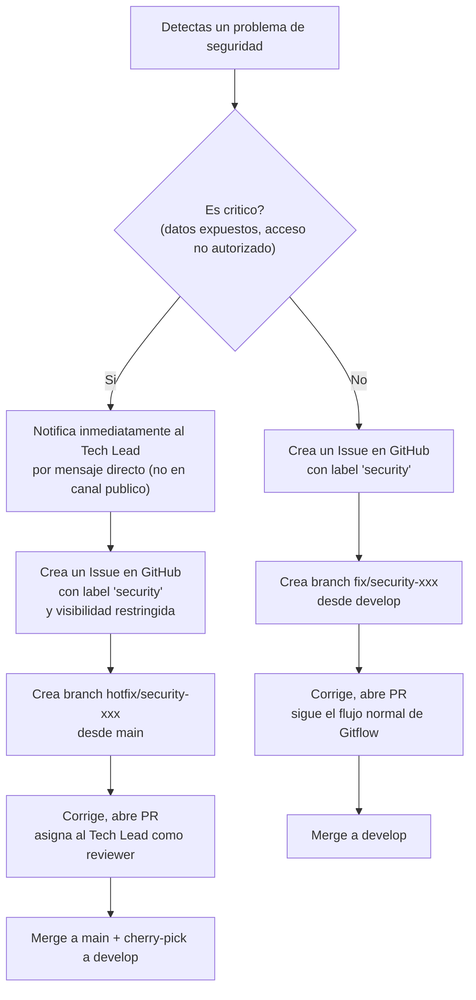

## 1. Reglas al Escribir Codigo

### Nunca hardcodear secretos

Ningun token, password, API key o credencial debe existir en el codigo fuente. Todo va en variables de entorno (`.env` en local, Secret Manager en produccion).

```typescript
// MAL
const stripe = new Stripe('sk_live_abc123...');

// BIEN
const stripe = new Stripe(this.configService.get('STRIPE_SECRET_KEY'));
```

### Siempre filtrar por organizationId

Cada query a la base de datos debe incluir el filtro de `organizationId` del usuario autenticado. Esto previene que un tenant acceda a datos de otro.

```typescript
// MAL - un usuario podria acceder a datos de otra organizacion
await this.prisma.workflow.findUnique({ where: { id } });

// BIEN - multi-tenancy seguro
await this.prisma.workflow.findUnique({
  where: { id, organizationId: user.organizationId },
});
```

### Validar roles en cada endpoint

Todo endpoint nuevo debe incluir el decorador `@Roles()` con los roles minimos necesarios. Si no se especifica, el endpoint queda abierto a cualquier usuario autenticado.

```typescript
@Delete(':id')
@Roles(UserRole.OWNER, UserRole.ADMIN) // Solo owner y admin pueden eliminar
async remove(@Param('id') id: string) { ... }
```

### No exponer datos internos en respuestas

Las respuestas de la API deben usar DTOs que excluyan campos sensibles como passwords, hashes, tokens internos o IDs de Stripe.

### Validar inputs con DTOs

Todo input del usuario debe pasar por un DTO con decoradores de `class-validator`. Nunca confiar en datos del cliente sin validar.

---

## 2. Flujo para Reportar un Bug de Seguridad

Si detectas un problema de seguridad (fuga de datos, bypass de permisos, credenciales expuestas, etc.), sigue este flujo:



### Labels de GitHub para seguridad

| Label | Cuando usarlo |
|---|---|
| `security` | Todo issue relacionado con seguridad |
| `priority: critical` | Requiere atencion inmediata (datos en riesgo) |
| `priority: high` | Importante pero no hay fuga activa |

---

## 3. Checklist antes de hacer PR

Antes de abrir un Pull Request, verifica estos puntos de seguridad:

- [ ] No hay secretos, tokens ni credenciales en el codigo
- [ ] Todas las queries filtran por `organizationId`
- [ ] Los endpoints nuevos tienen `@Roles()` con permisos adecuados
- [ ] Los inputs del usuario pasan por DTOs validados
- [ ] Las respuestas no exponen campos sensibles (passwords, hashes, stripeIds internos)
- [ ] Si se agrega una variable de entorno nueva, se agrego tambien al `.env.example`

---

## 4. Mecanismos de Seguridad Activos

Referencia rapida de las protecciones que ya estan implementadas en Tesseract:

| Capa | Mecanismo | Detalle |
|---|---|---|
| Autenticacion | JWT + Refresh Tokens | Access token de corta duracion, refresh token rotado |
| 2FA | TOTP | Opcional por usuario, verificado en login |
| Anti-bot | Cloudflare Turnstile | En formularios publicos (login, signup) |
| Passwords | bcrypt | Hash con salt, nunca almacenados en texto plano |
| Credenciales OAuth | Google Cloud KMS | Tokens de integraciones cifrados en reposo |
| API Keys | Hash SHA-256 | El valor original solo se muestra al momento de la creacion |
| Control de acceso | RBAC | 3 roles: owner, admin, viewer |
| Multi-tenancy | Filtro por organizationId | En todas las queries y guards |
| Transporte | HTTPS | Obligatorio en produccion (Cloud Run) |
